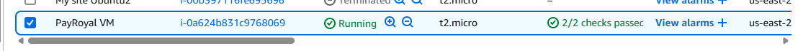
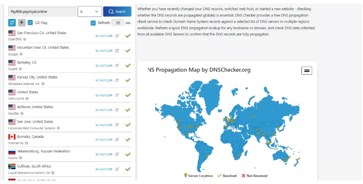
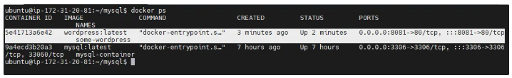
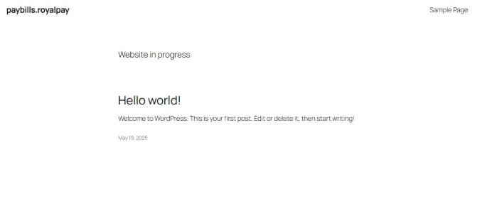

# 🚀 PayRoyal Deployment with Docker

This project shows how I deployed a WordPress website for PayRoyal using Docker and MySQL on an AWS virtual machine.

---

## 🖼️ Screenshots

**1. AWS Virtual Machine Creation**

Login to the server using mobaXterm through ssh-key

Run some initial Commands to install the required  Applications

 **Update the server** 

sudo apt update -y   

 **Install docker** 

 sudo apt install docker.io -y

 **Install Docker-compose**

sudo apt install docker-compose -y 

 Create a DNS Record with namecheap and map it to the ip address of the VM
 
 Verify that the domain has propagated globally by using DNSChecker.org
 
**DNS Propagation Check**

**Installation of sofwares and configuration (MYSQL)**

creation of folders for the MYSQL Initials
mysql/config
mysql/initdb
mysql/data

** configure mysql database**

Cat <<EOF > mysqld.cnf
[mysqld]
user = mysql
port = 3306
datadir = /var/lib/mysql
bind-address = 0.0.0.0
mysqlx-bind-address = 0.0.0.0
key_buffer_size = 16M
myisam-recover-options = BACKUP
general_log_file = /var/log/mysql/query.log
general_log = 1
log_error = /var/log/mysql/error.log
max_binlog_size = 100M
EOF

**creation of Startup file (mysql/initdb/)**

cat <<EOF > initdb/grant-all.sql
CREATE USER 'vincent2020'@'%' IDENTIFIED BY 'vincent@2020';
GRANT ALL PRIVILEGES ON *.* TO 'vincent2020'@'%' WITH GRANT OPTION;

CREATE USER 'wordpress'@'%' IDENTIFIED BY 'wordpress@123';
GRANT ALL PRIVILEGES ON *.* TO 'wordpress'@'%' WITH GRANT OPTION;

CREATE DATABASE wordpressdb;

FLUSH PRIVILEGES;
EOF

**Installation of MySQL using Docker command**

docker run --name mysql-container \
-v /home/ubuntu/mysql/config:/etc/mysql.conf.d \
-v /home/ubuntu/mysql/data:/var/lib/mysql \
-v /home/ubuntu/mysql/initdb:/docker-entrypoint-initdb.d \
-e MYSQL_ROOT_PASSWORD=Vincent2020 \
-p 3306:3306 \
-d mysql : latest

**Deployment the wordpress engine**

docker run --name some-wordpress \
-e WORDPRESS_DB_HOST=52.14.212.206:3306 \
-e WORDPRESS_DB_USER=wordpress \
-e WORDPRESS_DB_PASSWORD=Wordpress@2020 \
-e WORDPRESS_DB_NAME=royalpaydb \
-p 8081:80 \
-d wordpress:latest

**confirmed that the container is running using docker ps command**

**3. Running Docker Containers**

**Access the Wordpress Using http://paybills.payroyal.online:8081 on the local browser**
**4. Final Website**

---

## 🛠️ Tech Stack

- AWS EC2
- Docker & Docker Compose
- MySQL
- WordPress
- Namecheap DNS
- MobaXTerm (for SSH)

---

## 🧱 Folder Structure

├── README.md
├── images/
├── mysql/
│ ├── config/
│ └── initdb/
